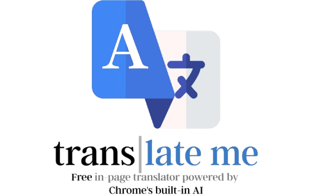
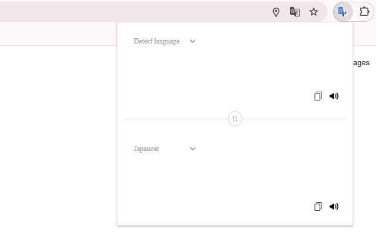
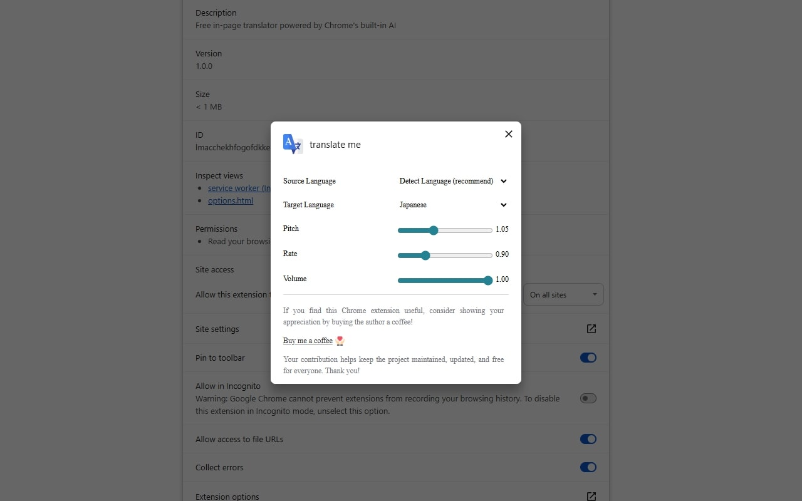

# translate me

  <picture>
    
  </picture>
  
  
    

  [View Chrome Extension](https://chromewebstore.google.com/detail/translate-me/fkoepnkpnaebnedkdnljkcdchljfoadi)

# ⚙️ Features

pop-up translate

translate selected text

settings control

## 📄 Privacy & Security

- **No personal data** – IP addresses, browsing history, or identifiers are never collected.

- **Secure transmission** – All translation requests go over HTTPS directly to Google’s servers.

- **Local storage only** – Preferences live in chrome.storage.local; they’re cleared when the extension is removed.

See full policy [here](https://translateme-privacy.netlify.app/)

## 📬 Support & Feedback

Got questions or want a new feature?

Open an issue on GitHub or email me at yeung.ming.sang@gmail.com

## 🎉 Thanks for using Translate‑Me!

Happy translating! 🚀
